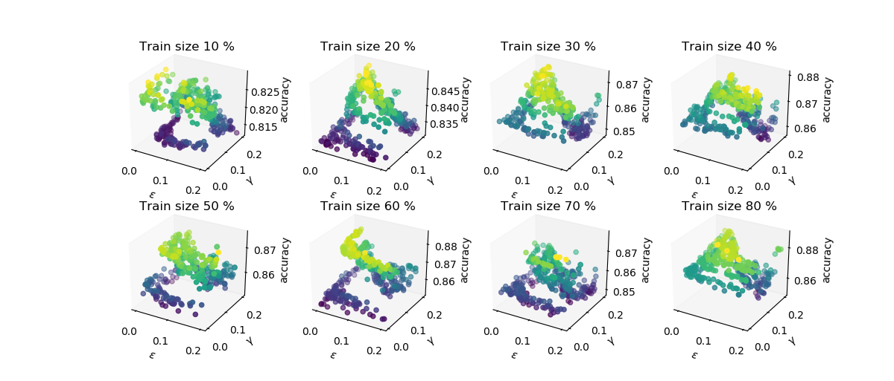
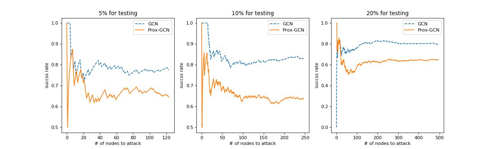

# LATGCN

## Motivation

* maximize the perturbation on the latent layer
* perturbation applied to all the nodes, due to the transductive learning property
* improve the accuracy
* reduce the success rate from adversarial attacks

## Usage

Instal the required packages
```
pip install -r requirements.txt
```

Run the demo of nettack with vanilla GCN
```
python demo.py
```
run the demo of nettack with ProxGCN
```
python demo.py
```

`demo.py` has a set of parameter to specify

```
--dataset:      choose from 
                'citeseer', 'cora', 'cora_ml', 'pubmed', 'polblogs', 'dblp'
--train_share:  specify the size for training
--reg:          a flag to toggle the ProxGCN
--eta:          the norm constraint of noise applied to each node embedding
--gamma:        regularizer factor
```

Note that without specify the `reg` flag, it is simply the vanilla GCN.

## Primary Result

Performance with perturbation on cora dataset:  


Success rate with perturbation on cora dataset:  


## Reference

The Nettack model is implemented by [Daniel Zügner](https://github.com/danielzuegner/nettack)  
The original GCN model is implemented by [Thomas N Kipf](https://github.com/tkipf/gcn)  

## Contact

Feel free to create issue in the repo, I will try to answer as soon as I can.

## Copyright

The work is under [MIT license](./LICENSE).
